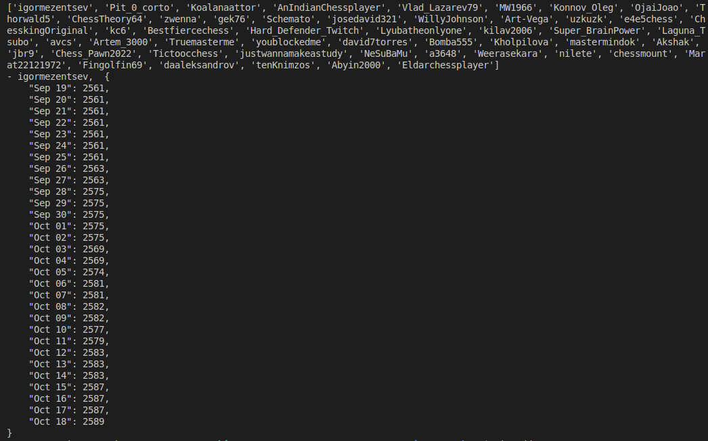

# Commure Assiggnment Chess



## Install dependencies with poetry

```sh
    poetry install
```

## Run tests

```sh
    poetry run python -m unittest discover
```

## Run Project

```sh
    poetry run ./commure_assignment_chess/main.py
```

## Project Output

[Open CSV File](./rating_history_50_players_30_days.csv)
